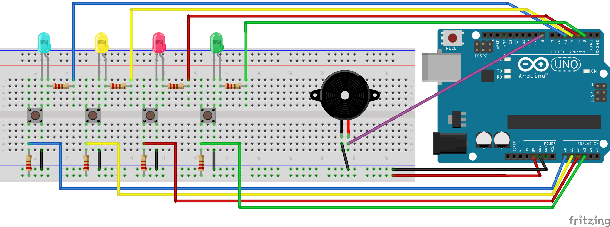

# arduinosays
A simple Simon Says game implemented on an Arduino Uno, based on [A Simple Simon Says Game](https://create.arduino.cc/projecthub/Arduino_Scuola/a-simple-simon-says-game-25ba99) by _Arduino_Scuola_ 

## Components

- x1 Arduino UNO R3
- x4 LEDs
- x4 Pushbuttons
- x4 1k resistors
- x4 10k resistors
- Jumper wires as needed (YMMV)
- x1 Piezo buzzer

## Schematics

